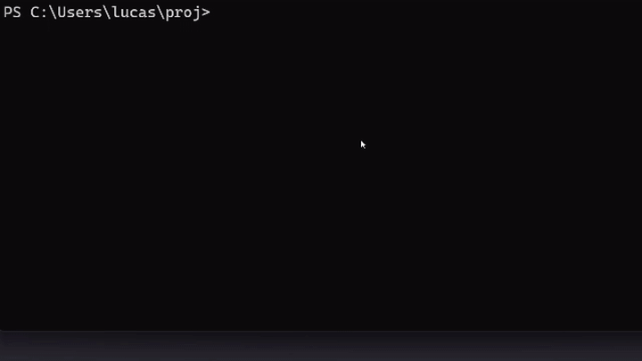

# Twitch Oauth Simple Refresh Token Grabber
A simple Python script to get fast the API refresh token of your Twitch app

## usage

- Set in your twitch console the url "http://localhost:\<port\>" for your app.
  By default port is 8000

- Set your client_id/secret in this script, or give them when launching it
- Set in the script the scopes you need your token for.
  See https://dev.twitch.tv/docs/authentication/scopes
- At script launch, a web page will open asking to authorize your app
- When authorized close the web page, go back to your terminal, grab the Refresh Token and voilà.

## Todo
- Error handling, if needed
- Better method to choose scopes?
